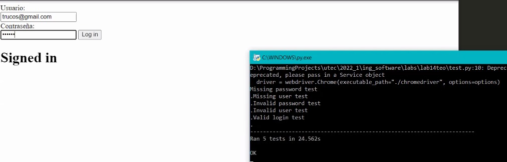

# Testing

Grupo: Fuerzas Especiales Ginyu
Integrantes:
* Eduardo Arróspide
* Grover Ugarte
* Pedro Dominguez
* Ian Cortez


## Para generar la base de datos se debe ejecutar el script adjunto y cambiar las credenciales de postgres.
```sql
create table Junio14(
    correo varchar(255) primary key,
    clave varchar(255)
);

insert into junio14 VALUES(
    'trucos@gmail.com', 'abcdef'
);

insert into junio14 VALUES(
    'trucos1@gmail.com', 'abc'
);

insert into junio14 VALUES(
    'trucos0@gmail.com', 'af'
);

insert into junio14 VALUES(
    'trucos3@gmail.com', 'ab'
);
```

## Prueba
